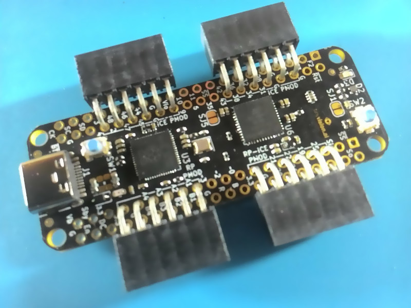

# Getting Started

Once you receive the board,
you would be able to plug via USB and see the RGB LED blinking.

This is the FPGA bitstream project loaded onto the board by default.
You can replace it with your own by one of the [FPGA programming methods](/programming_the_fpga.html).

You can also [program the RP2040 microcontroller](/programming_the_mcu.html) using the standard procedure of any Raspberry Pi Pico board.

## Soldering the PMODs

In case you ordered the board without the PMODs soldered, you would need to solder them in.

The suggested way to solder the PMODs is as seen below:

This lets the other pins accessible from jumper cables for instance:

It is also possible to solder a full pin header row on each side for use on a breadboard,
or any other way.
