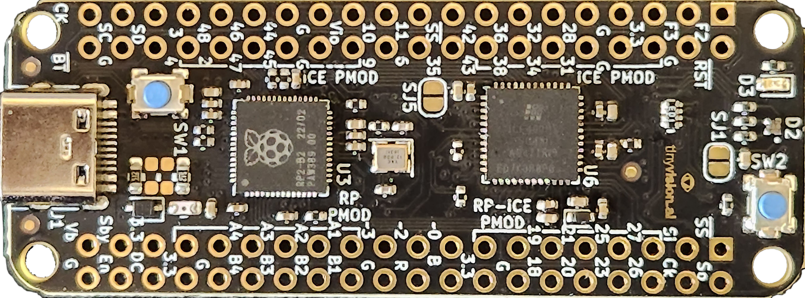
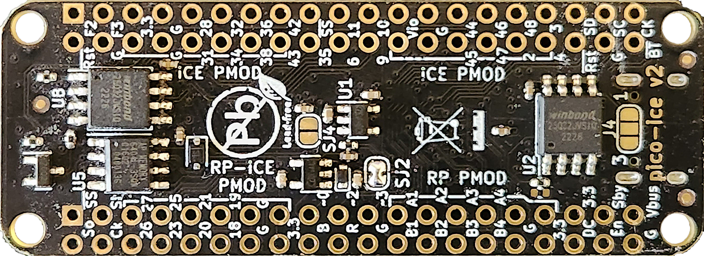

# pico-ice

The pico-ice is a small, low cost board with the Raspberry Pi Pico processor (RP2040) and a Lattice Semiconductor iCE40UP5K FPGA. The board features independent flash for the FPGA and RP2040, low power SSRAM, a couple of pushbuttons and a 3 color LED with _all_ FPGA and RP2040 pins brought out to easy to use 0.1" header pins (arranged as PMOD's) for fast prototyping.

The tinyVision.ai pico-ice Board Features:

* RaspberryPi RP2040 processor
* Lattice UltraPlus ICE40UP5K FPGA with 5.3K LUTs, 1Mb SPRAM, 120Kb DPRAM, 8 Multipliers
* _ALL_ RP2040 and 32 FPGA GPIO on 0.1” headers
* 4MB SPI Flash
* 8MB low power qSPI SRAM
* RGB LED, shared between the RP2040 and FPGA
* 2 pushbuttons, 1 dedicated and 1 primarily for processor reset during development but can be repurposed for user applications when not used for reset
* On board 3.3V and 1.2V Regulators, can supply 3.3V to your project
* Open source schematic and layout using KiCAD design tools
* 4 layer board with a solid ground plane for good signal integrity

Board and Firmware features:

* FPGA clock supplied by the RP2040, easy to program FPGA clock under SW control
* RP2040 can program the FPGA and also provides a pass through UART function
* Examples for communicating to the FPGA over SPI
* Support for ultra low power sleeep mode: can shut down the RP2040 and FPGA while keeping the SRAM powered

Here are some resources for you:

* [Documentation](https://tinyvision-ai-inc.github.io/pico-ice/)
* [Git Repository](https://github.com/tinyvision-ai-inc/pico-ice) (hardware)
* [Git Repository](https://github.com/tinyvision-ai-inc/pico-ice-sdk) (SDK)
* [Discord channel](https://discord.gg/3qbXujE)
* [Schematic](https://raw.githubusercontent.com/tinyvision-ai-inc/pico-ice/main/Board/Rev2/pico-ice.pdf)
* [Assembly Drawing](#)
* [Pico Blinking LED](#)
* [FPGA Blinking LED](#)
