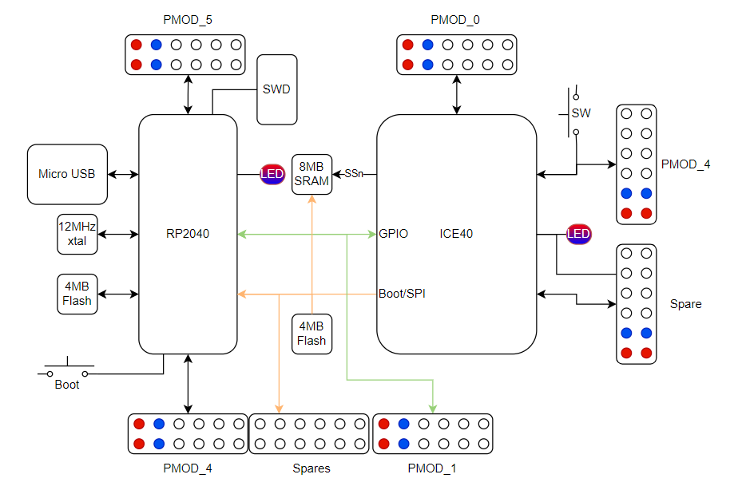

# pico-ice

[Doc](http://pico-ice.tinyvision.ai/)
| [Hardware](https://github.com/tinyvision-ai-inc/pico-ice)
| [Software](https://github.com/tinyvision-ai-inc/pico-ice-sdk)
| [Schematic](https://raw.githubusercontent.com/tinyvision-ai-inc/pico-ice/main/Board/Rev3/pico-ice.pdf)
| [Assembly](https://htmlpreview.github.io/?https://github.com/tinyvision-ai-inc/pico-ice/blob/main/Board/Rev3/bom/ibom.html)
| [Discord](https://discord.gg/t2CzbAYeD2)

The pico-ice is a small, low cost board with the Raspberry Pi Pico processor ([RP2040](https://www.raspberrypi.com/documentation/microcontrollers/rp2040.html)) and a Lattice Semiconductor [iCE40UP5K](https://www.latticesemi.com/en/Products/FPGAandCPLD/iCE40UltraPlus) FPGA. The board features independent flash for the FPGA and RP2040, low power SSRAM, a couple of pushbuttons and a 3 color LED with _all_ FPGA and RP2040 pins brought out to easy to use 0.1" header pins (arranged as Pmod's) for fast prototyping.

The tinyVision.ai pico-ice Board Features:

* Raspberry Pi RP2040 processor
* Lattice UltraPlus ICE40UP5K FPGA with 5.3k LUTs, 1Mb SPRAM, 120Kb DPRAM, 8 Multipliers
* _ALL_ RP2040 and 32 FPGA GPIO on 0.1” headers
* 4MB SPI Flash
* 8MB low power qSPI SRAM
* RGB LED, shared between the RP2040 and FPGA
* 2 pushbuttons, 1 dedicated and 1 primarily for processor reset during development but can be repurposed for user applications when not used for reset
* On board 3.3V and 1.2V Regulators, can supply 3.3V to your project
* Open source schematic and layout using KiCAD design tools
* 4 layer board with a solid ground plane for good signal integrity

Board and Firmware features:

* FPGA clock supplied by the RP2040, easy to program FPGA clock under SW control
* RP2040 can program the FPGA and also provides a pass through UART function
* Examples for communicating to the FPGA over SPI
* Support for ultra low power sleeep mode: can shut down the RP2040 and FPGA while keeping the SRAM powered

[OSHW US002140](https://certification.oshwa.org/us002140.html) | Certified open source hardware | oshwa.org/cert
